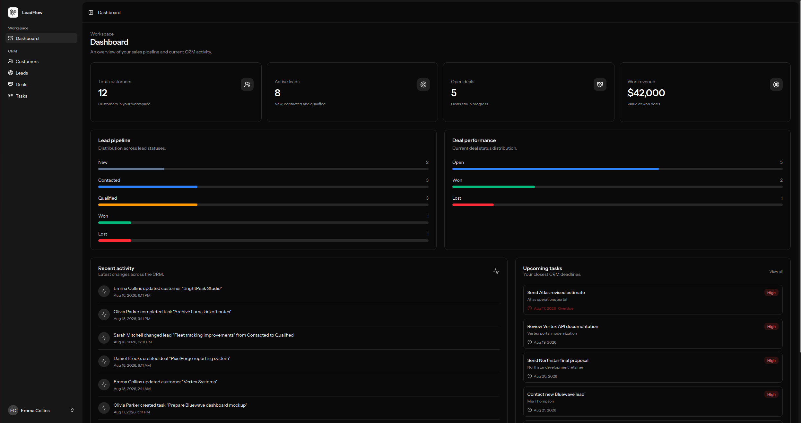
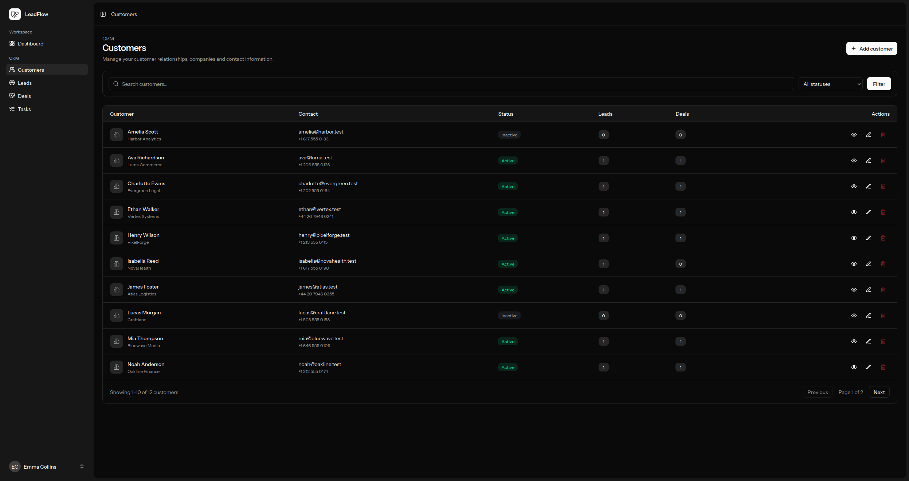
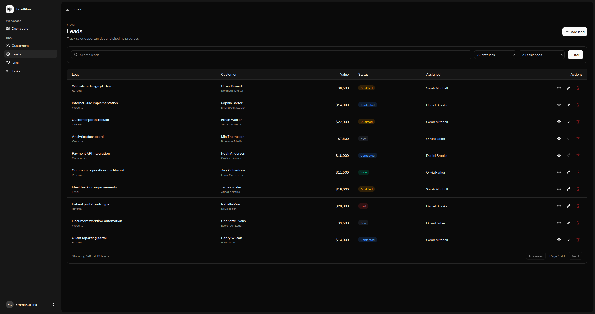
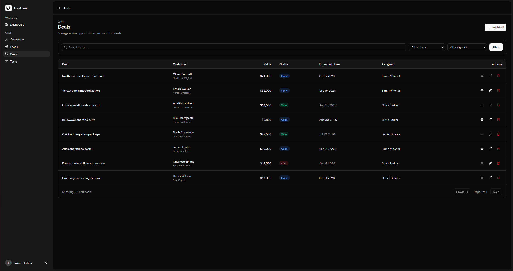
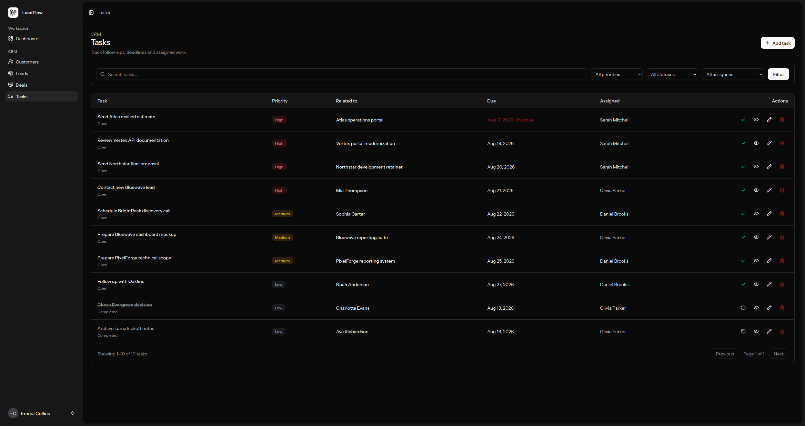

# LeadFlow — Mini CRM

LeadFlow is a modern mini CRM built with Laravel, Inertia.js, React, and TypeScript.

It provides a complete workspace for managing customers, sales leads, deals, follow-up tasks, and CRM activity, with role-based permissions, a data-driven dashboard, typed application boundaries, and comprehensive feature tests.

The project was built as a production-style portfolio application with a strong focus on clean backend architecture, maintainability, authorization, test coverage, and a polished user experience.

---

## Screenshots

### Dashboard



### Customers



### Leads



### Deals



### Tasks



---

## Features

### Dashboard

- Total customer metrics
- Active lead metrics
- Open deal metrics
- Won revenue tracking
- Lead pipeline breakdown
- Deal status breakdown
- Recent CRM activity
- Upcoming tasks
- Overdue task indicators
- Role-aware dashboard visibility

### Customers

- Complete CRUD management
- Search and status filtering
- Customer contact information
- Active / inactive status
- Related lead and deal counters
- Detailed customer pages
- Role-based access control

### Leads

- Sales pipeline management
- Customer relationships
- User assignment
- Estimated value tracking
- Lead source tracking
- Search and filtering
- Role-aware record visibility
- Restricted updates for assigned users

Lead statuses:

- New
- Contacted
- Qualified
- Won
- Lost

### Deals

- Deal value tracking
- Customer relationships
- User assignment
- Expected close dates
- Revenue tracking
- Search and filtering
- Role-aware record visibility
- Restricted updates for assigned users

Deal statuses:

- Open
- Won
- Lost

### Tasks

- Customer or deal relationships
- User assignment
- Priority levels
- Due dates
- Overdue detection
- Complete / reopen workflow
- Search and filtering
- Role-aware record visibility
- Restricted updates for assigned users

Task priorities:

- Low
- Medium
- High

### Activity Log

LeadFlow records important CRM actions such as:

- Customer creation
- Customer updates
- Customer deletion
- Lead creation
- Lead status changes
- Lead deletion
- Deal creation
- Deal status changes
- Deal deletion
- Task creation
- Task completion
- Task reopening
- Task deletion

Activity logging is integrated into the application service layer and runs inside database transactions alongside the related CRM operation.

---

## Roles & Permissions

LeadFlow includes three user roles.

### Admin

Full access to the CRM workspace.

### Manager

Can manage customers, leads, deals, and tasks across the workspace.

### User

Can only access CRM records assigned to them.

Regular users may update selected operational fields, but protected ownership and commercial data cannot be changed.

Examples of protected fields include:

- Lead customer
- Lead assignee
- Lead title
- Lead estimated value
- Lead source
- Deal customer
- Deal assignee
- Deal title
- Deal value
- Deal expected close date
- Task title
- Task assignee
- Task relationship
- Task priority
- Task due date

These restrictions are enforced on the server side and covered by feature tests, including explicit tampering attempts.

---

## Architecture

The backend is split into application layers instead of placing business logic directly inside controllers.

```text
HTTP Request
    ↓
Form Request
    ↓
DTO
    ↓
Service
    ↓
Repository
    ↓
Eloquent / Database
    ↓
API Resource
    ↓
Inertia
    ↓
React UI
```

### Controllers

Controllers remain thin and are responsible mainly for HTTP orchestration.

### Form Requests

Validation and request authorization are separated from controllers.

### DTOs

Validated request data is converted into typed Data Transfer Objects before entering the application layer.

### Services

Business rules and application workflows live inside service classes.

Examples include:

- Restricted user updates
- Task completion and reopening
- Activity logging
- Database transaction orchestration

### Repositories

Database queries and persistence logic are isolated behind repository interfaces.

### Resources

Laravel API Resources provide explicit response contracts between backend models and the React frontend.

### Policies

Authorization rules define which users can view, create, update, and delete CRM records.

---

## Tech Stack

### Backend

- PHP
- Laravel
- PostgreSQL
- Eloquent ORM
- Laravel Policies
- Form Requests
- API Resources
- Service Layer
- Repository Pattern
- DTOs

### Frontend

- React
- TypeScript
- Inertia.js
- Tailwind CSS
- shadcn/ui
- Lucide Icons
- Wayfinder
- Vite

### Quality & Testing

- Pest
- Laravel Feature Tests
- PHPStan / Larastan
- Laravel Pint
- ESLint
- TypeScript
- Vite production build checks

---

## Testing

The project contains feature tests covering complete CRM workflows rather than only isolated units.

Coverage includes:

- Authentication requirements
- Role-based authorization
- CRUD operations
- Validation
- Search and filtering
- Record visibility
- User assignment restrictions
- Protected-field tampering attempts
- Activity logging
- Task completion and reopening
- Dashboard metrics
- Dashboard status breakdowns
- Dashboard record isolation
- Recent activity ordering
- Upcoming task ordering

Run the full Laravel test suite:

```bash
php artisan test
```

Run static analysis:

```bash
composer types:check
```

Run Laravel Pint:

```bash
./vendor/bin/pint
```

Run frontend checks:

```bash
npm run format
npm run lint
npm run build
```

Run the complete project quality check:

```bash
composer ci:check
```

---

## Demo Data

LeadFlow includes a deterministic demo dataset designed for portfolio presentation.

It contains:

- Admin account
- Manager account
- Sales users
- Customers
- Leads
- Deals
- Tasks
- Activity history
- Won revenue
- Open opportunities
- Upcoming tasks
- Overdue tasks

Reset the database and load the demo workspace:

```bash
php artisan migrate:fresh --seed
```

### Demo Manager

```text
Email: manager@leadflow.test
Password: password
```

---

## Local Installation

Clone the repository:

```bash
git clone https://github.com/cristalNichita/leadflow.git
cd leadflow
```

Install PHP dependencies:

```bash
composer install
```

Install frontend dependencies:

```bash
npm install
```

Create the environment file:

```bash
cp .env.example .env
```

Generate the application key:

```bash
php artisan key:generate
```

Configure PostgreSQL in `.env`:

```env
DB_CONNECTION=pgsql
DB_HOST=127.0.0.1
DB_PORT=5432
DB_DATABASE=leadflow
DB_USERNAME=postgres
DB_PASSWORD=
```

Run migrations and load demo data:

```bash
php artisan migrate --seed
```

Start the development environment:

```bash
composer dev
```

Open:

```text
http://127.0.0.1:8000
```

---

## Project Structure

```text
app/
├── Data/
│   ├── Activities/
│   ├── Customers/
│   ├── Dashboard/
│   ├── Deals/
│   ├── Leads/
│   └── Tasks/
├── Http/
│   ├── Controllers/
│   ├── Requests/
│   └── Resources/
├── Models/
├── Policies/
├── Repositories/
│   └── Contracts/
└── Services/

database/
├── factories/
└── seeders/

resources/js/
├── components/
│   ├── crm/
│   ├── customers/
│   ├── deals/
│   ├── leads/
│   ├── tasks/
│   └── ui/
├── lib/
├── pages/
│   ├── customers/
│   ├── deals/
│   ├── leads/
│   └── tasks/
├── routes/
└── types/

tests/Feature/
├── Activities/
├── Customers/
├── Dashboard/
├── Deals/
├── Leads/
└── Tasks/
```

---

## Demo Workflow

A typical CRM workflow in LeadFlow looks like this:

1. Create or open a customer.
2. Add a lead and assign it to a sales user.
3. Move the lead through the sales pipeline.
4. Create a deal for the commercial opportunity.
5. Track deal value and expected close date.
6. Create follow-up tasks related to the customer or deal.
7. Complete or reopen assigned tasks.
8. Review workspace metrics and recent activity on the dashboard.

---

## Security & Business Rules

LeadFlow does not rely on hidden frontend controls for authorization.

Permissions and update restrictions are enforced on the server.

For example, a regular user assigned to a lead may update its workflow status and notes, but cannot submit a modified request to change the lead's customer, assignee, value, title, or source.

The same protection exists for deals and tasks.

These scenarios are covered by dedicated feature tests.

---

## Purpose

LeadFlow was designed as a compact but production-style CRM demonstrating full-stack Laravel development beyond basic CRUD.

The project focuses on:

- Maintainable architecture
- Explicit application layers
- Typed request and response boundaries
- Server-side authorization
- Business-rule enforcement
- Automated feature testing
- Static analysis
- Consistent code formatting
- Modern React UI
- Realistic demo data

It is intended as a portfolio project demonstrating the structure and quality expected from a commercial web application.
